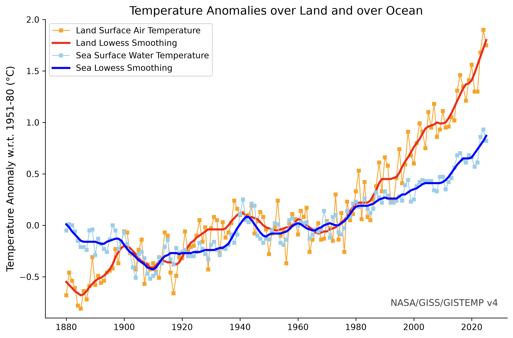
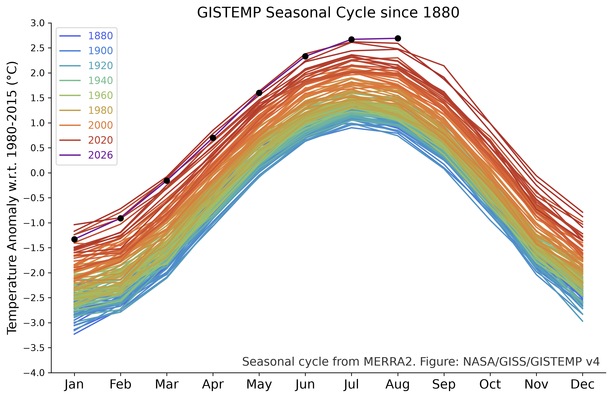
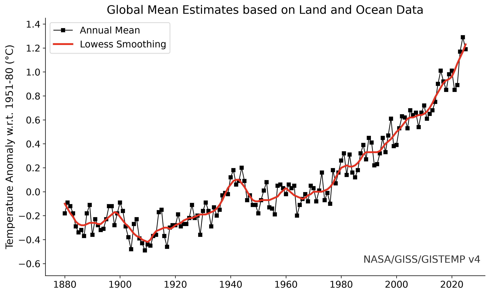
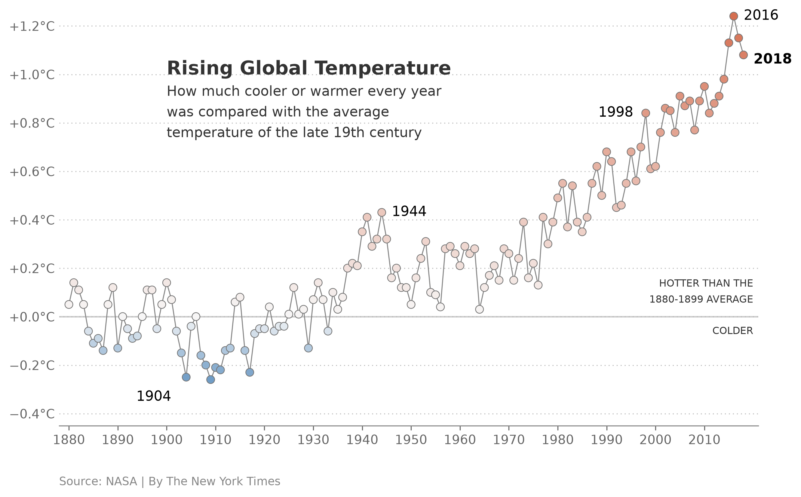

# Replicating Global Temperature Anomaly Graphics from NYT

This project replicates four  graphics of global surface temperature anomalies using NASA GISS Surface Temperature Analysis (GISTEMP v4) data. Three graphics come from NASA's GISTEMP website, and the fourth is the New York Times chart "Rising Global Temperature", which re-plots the same global annual mean on a different baseline. Each graphic is built in its own Jupyter notebook in scripts/, from  CSV files in data/, and saved as PNG and PDF in outputs/.

All four graphics tell the same story from different angles. Temperatures stayed close to their late 19th century level until about the 1970s and have risen steadily since. By 2025 the global annual mean is about 1.2 °C above the 1951-1980 average, land has warmed roughly twice as much as the ocean, and the whole seasonal cycle has shifted upward. The replications match the originals closely; the small differences come from NASA revising GISTEMP v4 since the originals were published, from columns missing in the downloadable CSVs, and from colors and fonts that were matched by eye.

Graphic 1: 
Annual temperature anomalies over land and ocean, from 1951-1980, each shown as yearly values and a 5-year Lowess smoothing. Both rise after the 1970s, but land warms faster: the smoothed land anomaly is about +1.8 °C in 2025, compared with about +0.9 °C over the ocean.

Graphic 2:
Monthly temperature anomalies relative to 1980-2015, with one line per year from 1880-2026, colored from blue (oldest) to purple (latest). Every year has the same shape, coldest in winter months and warmest in summer months, but the whole curve has shifted upward: recent years sit well above the 1880s in every month.

Graphic 3:
The global annual mean surface temperature anomaly relative to 1951-1980 (black squares), with a Lowess-smoothed trend (red line). Temperatures stayed within about 0.3 °C of the 1951-1980 average until the late 1970s, then rose steadily, reaching about +1.2 °C by 2025.

Graphic 4:
The same global annual mean as Graphic 3, cut at 2018 and re-baselined to the 1880-1899 average, with each year drawn as a dot colored from blue (cooler) to red (warmer). Relative to the 1800's, global temperature rose 1.1 °C by 2018, and 2018 ranks as the fourth-warmest year after 2016, 2017 and 2015, matching the article's headline.